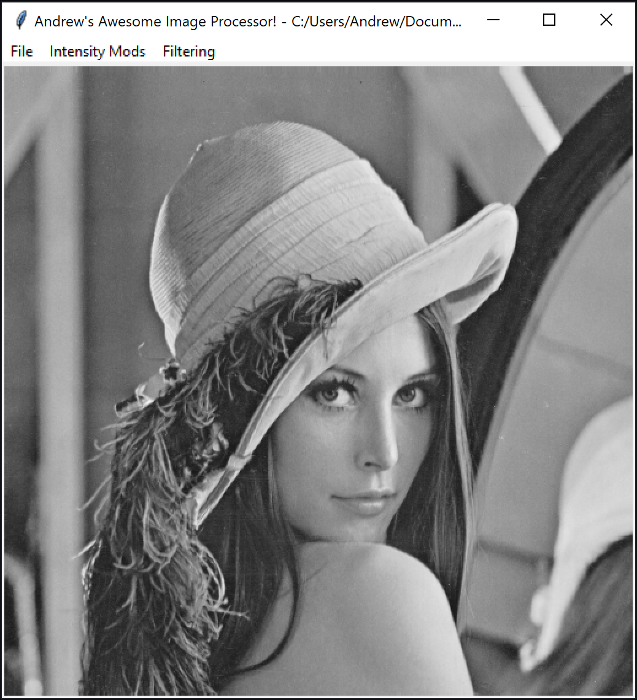

# Image Processing Toolkit

_Author: Andrew Bridglall_

## Summary

The goal of this project was to build a GUI that incorporated image modification features in a way that was accessible to non-programmers. This GUI design prompts the user to select a file to view, then opens the image in a separate window. From there, the user has a menu of image modification options to choose from. Additional features include an "undo" button, which allows the user to revert back to the prior image and a "save file" button which allows the user to save a modified image they made.

One the difficulties I overcame in this project was learning how to properly display images. Doing so required converting matplotlib.pyplot images first to numpy arrays then to PIL images. I was in part inspired by the minimalist tkinter layout from [pyimgtool](https://github.com/thevimal98/pyimgtool), which relied on a menu bar and a single window.

## Functionality

1. ### Point Processing
   - Negative transform
   - Bit reduction
   - Gamma correction
   - Histogram equalization (local and global)
2. ### Neighborhood Processing
   - Smoothing (Box and Gaussian)
   - Sharpening (Laplacian, Unsharpen)
   - Statistical filters (Min, Median, Max)
